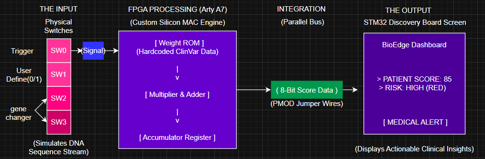
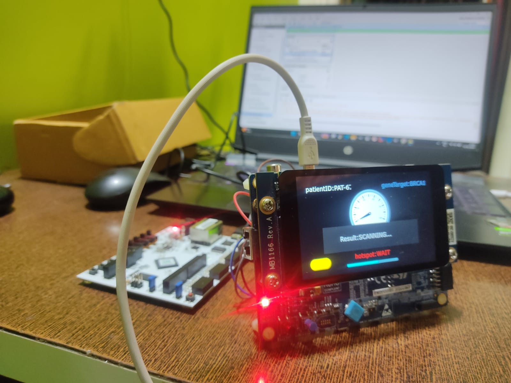

# BioEdge

BioEdge is a hardware–software project that combines an FPGA-based accelerator design with a Python software stack. The repository is organized into two main parts:

- **BioEdge_Hardware** – Vivado project for the FPGA design
- **BioEdge_Project** – Higher-level project with HDL sources, testbenches, data, and Python utilities

> Note: Large raw datasets are **not** stored in this repository (they are ignored via `.gitignore`). See the Data section below for guidance.

The overall system architecture is shown below:



## Repository structure

- **BioEdge_Hardware/**
  - Full Vivado project (`BioEdge_Hardware.xpr`) and generated files
  - `BioEdge_Hardware.srcs/` – HDL sources and constraints used by the Vivado project
  - `BioEdge_Hardware.ip_user_files/` – IP-related initialization files (e.g. ROM weights)
  - `BioEdge_Hardware.runs/`, `BioEdge_Hardware.sim/` – Vivado run/simulation outputs (re-generated by Vivado)

- **BioEdge_Project/**
  - `data/` – Input datasets used by the project (large reference files are **local-only**)
  - `docs/` – Documentation such as a technical report
  - `hardware/`
    - `constraints/` – Board constraint files (e.g. `arty_a7_35t.xdc`)
    - `hdl/` – HDL sources for the top-level design and submodules
    - `tb/` – Testbench sources
    - `vivado_build/` – Helper Vivado project wrapper that points to the main hardware design
  - `software/`
    - Python scripts and notebooks for training, quantization, and dashboard/host-side logic

## Hardware design (FPGA)

The FPGA design lives primarily in:

- Vivado project: `BioEdge_Hardware/`
- Standalone HDL sources: `BioEdge_Project/hardware/hdl/`
- Constraints: `BioEdge_Project/hardware/constraints/`
- Testbench: `BioEdge_Project/hardware/tb/`

Typical workflow:

1. Open Vivado and load the project:
   - **File → Open Project** and select `BioEdge_Hardware/BioEdge_Hardware.xpr`.
2. Synthesize and implement the design.
3. Generate bitstream and program the target board (e.g. Arty A7-35T) using the provided constraint file.

An example prototype setup of the FPGA board and display is shown below:



## Software and training

The Python-side components are in `BioEdge_Project/software/` and include:

- Training/quantization notebooks (e.g. `phase1_training.ipynb`)
- Support scripts (e.g. `quantization.py`, `dashboard.py`)
- Weight/ROM initialization files used by the hardware (`multi_gene_weights.mem`, `weights_export.mem`)

A typical software workflow would be:

1. Create and activate a Python virtual environment inside `BioEdge_Project/`.
2. Install required packages (e.g. `numpy`, `pandas`, `scikit-learn`, `jupyter`, etc. depending on your notebooks).
3. Run Jupyter and open the training notebook:
   ```bash
   cd BioEdge_Project
   jupyter notebook
   ```
4. Export trained weights to `.mem` files, then use them in the hardware ROM/BRAM initialization.

## Data

This repo references large genomic or reference data files under `BioEdge_Project/data/`, but **those very large files are intentionally not committed** (they exceed GitHub's file size limits and are ignored by `.gitignore`).

If you are setting this project up on a new machine:

- Place the required datasets under `BioEdge_Project/data/` following the naming expected by your notebooks/scripts.
- For very large reference files (e.g. FASTA `.fna.gz` or summary `.txt.gz` files), store them locally or in external storage and keep them out of git.

## Regenerating Vivado outputs

Many files under `BioEdge_Hardware.runs/` and `BioEdge_Hardware.sim/` are generated as part of synthesis, implementation, and simulation. They do **not** need to be version-controlled and can be regenerated by rerunning the appropriate Vivado flows.

If Vivado reports missing run artifacts:

1. Open the main project `BioEdge_Hardware.xpr`.
2. Re-run synthesis and implementation.
3. Re-generate the bitstream and timing/power reports.

## Getting started

1. **Clone the repository**
   ```bash
   git clone https://github.com/ARPIT20012005/BioEdge.git
   cd BioEdge
   ```
2. **Set up data** under `BioEdge_Project/data/` (obtain from your original source).
3. **Open the Vivado project** from `BioEdge_Hardware/` and build the design.
4. **Set up Python env** in `BioEdge_Project/` and run notebooks/scripts as needed to prepare weights and host-side logic.

You can adapt this README as the project evolves (for example, by adding exact package requirements, board setup instructions, and detailed algorithm descriptions).
